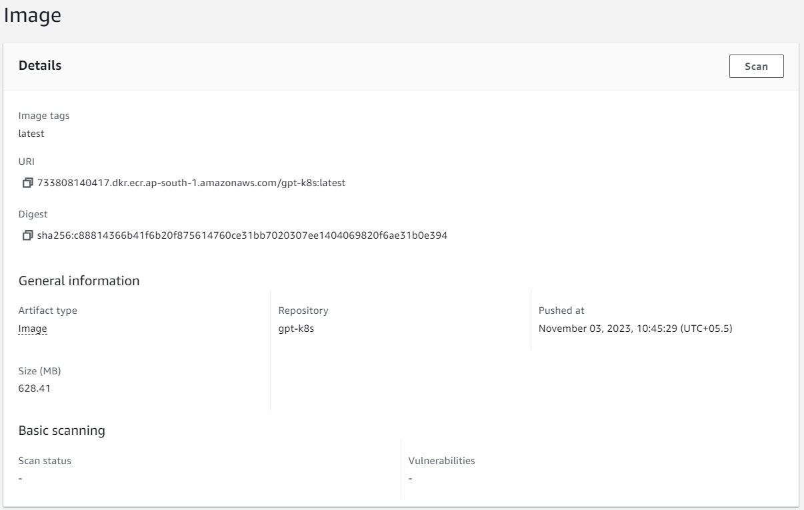

# Deploy GPT2  model with FastAPI using AWS Cluster and Helm

Provide the text sentence as an input the model will complete the sentence using GPT2 model


![fastapi[all]](https://img.shields.io/badge/fastapi[all]-0.98.0-green)


## Topics
```
1. Deploy the GPT2 model on AWS using HELM.
2. Use ClusterAutoScaler, and HorizontalPodScaler
3. Create an artificial load on the service
4. Print the Latency of the Inference
5. Log the HPA metrics, like we did in the session
6. Pods and Nodes should automatically scale out and scale in when needed.
```
## 1. Docker Image
`1. Download the GPT2 Model from hugging face and use it for infercing using FastAPI. (server.py)`
`2. Deploy and test the GPT2 using using Docker`
```
#Build docker image: 
docker compose build

#Run docker image: 
docker compose up
```
## 2. AWS Image
`Create the ECR cluster and push the docker image to ECR repository`


## 3. Create Cluster on AWS
`Created a cluster.yaml file to deploy the cluster on AWS. Used two node group one dedicated and one spot.`

## 4. Enable OIDC on your EKS Cluster
```
eksctl utils associate-iam-oidc-provider --region ap-south-1 --cluster basic-cluster2 --approve

curl -o iam-policy.json https://raw.githubusercontent.com/kubernetes-sigs/aws-load-balancer-controller/v2.6.0/docs/install/iam_policy.json

aws iam create-policy --policy-name AWSLoadBalancerControllerIAMPolicy --policy-document file://iam-policy.json
```

## 5. Create IAM Role for Service Account (IRSA)
`Use the following command to create the IRSA one AWS. Change the arn to the latest aws load balancer on IAM roles`

```
eksctl create iamserviceaccount 
--cluster=basic-cluster2 
--namespace=kube-system 
--name=aws-load-balancer-controller 
--attach-policy-arn=arn:aws:iam::733808140417:policy/AWSLoadBalancerControllerIAMPolicy 
--override-existing-serviceaccounts 
--region ap-south-1 
--approve

```


## 6. Deploy  aws load balancer controller using HELM
```
helm repo add eks https://aws.github.io/eks-charts

helm install aws-load-balancer-controller eks/aws-load-balancer-controller -n kube-system --set clusterName=basic-cluster2 --set serviceAccount.create=false --set serviceAccount.name=aws-load-balancer-controller
```

## 7. Deploy aws load balancer controller using HELM

```
# 1. Create the helm templates and value yaml. 
helm create gpt-aws-helm

# 2. Delete all the files from the template yaml and paste the deployment, serive, ingress and HPA yaml into the template folder

# 3. Update the value.yaml file in helm and make the changes in deployment, serivce and ingress, HPA yaml accordingly. 

# 4.  Run the templates and values in helm 
helm install fastapi-release .\fastapi-helm

# 5. Check status of all pods
kubectl get all -n kube-system

# 6. Check the helm release 
helm ls --all-namespaces

# 7. Use port forward to access the fast api app
kubectl port-forward service/gpt-service 80:80 
```


## 8. Load Testing
- Create a load file in python to genreate the artifical load on the AWS cluster and test the HPA and CA
```
python load.py
```
-Latany before load

-Latany after load


## 9. HPA status and Latancy testing

- Check scaling of HPA
```
kubectl get hpa gpt-hpa -n kube-system --watch
```


- Check for CPU and Memory usage by each pod
```
kubectl top pod -n kube-system
```
-Top pods without load 


-Top pods with Load


- Get details of all yaml configuration
```
kubectl get all -A -o yaml > "logs_all.txt"
```
## Group Members
- Anurag Mittal
- Aman Jaipuria
